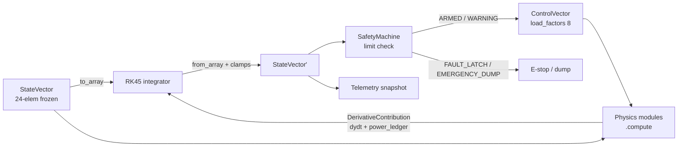

# SERIES-2-MHD-GEN-4 — System Architecture

## Resonant Genesis LLC / DynoGatorLabs — Companion to `WHITEPAPER.md`

This document describes the **signal flow** and **module topology** of the digital
twin. It is the map from "physics on the left" to "meters on the right." For the
theory of each block, see `WHITEPAPER.md`. For what has been proven or killed, see
`FALSIFICATION.md`.

> The meter is the master. This document exists so the meters can agree.

---

## 1. Layered View

The system is organized into five cooperating layers. Data flows **up** (physics →
telemetry) and control flows **down** (control → physics/hardware).

```
                 ┌───────────────────────────────────────────────┐
   operator ───▶ │  GUI  (PyQt6)                                  │
   E-stop   ───▶ │  strip charts · schematic · gate runner · HIL │
                 └───────────────┬───────────────────────────────┘
                                 │ ZeroMQ 10 Hz  /  E-stop line
                 ┌───────────────▼───────────────────────────────┐
                 │  TELEMETRY   dslv_zpdi_pipeline · streaming    │
                 │              JSONL/HDF5 trace · DSLV-ZPDI      │
                 └───────────────▲───────────────────────────────┘
                                 │ StateVector (24-elem) snapshots
   ┌─────────────────────────────┴───────────────────────────────┐
   │  CONTROL   TwinStateMachine(15) · FPGA phase engine          │
   │            PID · MPC · SafetyMachine(FAULT_LATCH, 2-ack)     │
   └─────────────────────────────┬───────────────────────────────┘
                                 │ ControlVector (load_factors[8], …)
   ┌─────────────────────────────▼───────────────────────────────┐
   │  DIGITAL TWIN (fidelity ladder)                              │
   │   lumped_model → network_1d → channel_2d → cfd_bridge        │
   └─────────────────────────────┬───────────────────────────────┘
                                 │ DerivativeContribution(dydt, power_ledger)
   ┌─────────────────────────────▼───────────────────────────────┐
   │  PHYSICS   mhd · thermo · mechanical · electromagnetic       │
   │            acoustic · exergy · scavengers                    │
   └─────────────────────────────┬───────────────────────────────┘
                                 │ mock/real hardware boundary
   ┌─────────────────────────────▼───────────────────────────────┐
   │  HARDWARE  fpga_interface · pps_capture · gpsdo_sync         │
   │            rtl/ (pps_tdc, phase_controller, spi_adc, top)    │
   └───────────────────────────────────────────────────────────────┘
```

---

## 2. The Integration Loop (one time step)

Every step of the RK45 integrator is a closed cycle over the same data contracts.
The contracts are load-bearing — breaking a field name breaks the whole loop.



**Contracts (do not rename — see `WHITEPAPER.md` §1 and handoff §3):**

| Contract | Shape | Rule |
|----------|-------|------|
| `StateVector` | 24 elems: 8 core + 8 currents + 8 voltages | frozen; mutate only via `.evolve()`; `from_array()` clamps `T_core≥1e-3`, `p_vessel≥1e-3`, `V_accum≥1e-6`, `coherence_r∈[0,1]` |
| `DerivativeContribution` | `dydt`, `power_ledger` | field names are canonical — **not** `derivatives`/`ledger` |
| `ControlVector` | 11 fields incl. `load_resistances[8]`, `load_factors[8]` | produced by control layer, consumed by physics |
| `SafetyMachine` | `ARMED · WARNING · FAULT_LATCH · EMERGENCY_DUMP` | no self-clear; `FAULT_LATCH` needs `reset(ack_1, ack_2, investigation)` |
| `TwinStateMachine` | 15 states | `current_state` is a **property**; transition via `transition(StateEvent.X)` |

---

## 3. Digital-Twin Fidelity Ladder

The same physics is solved at four increasing resolutions. A claim is only trusted
when it survives promotion up the ladder without changing sign.

```
 lumped_model.py   0-D energy/power balance        fast, GUI-rate, gate screening
       │
 network_1d.py     8-segment Faraday network        modal ID, FPGA-in-the-loop
       │
 channel_2d.py     2-D axisymmetric channel         field maps, distributed nodes
       │
 cfd_bridge.py     OpenFOAM custom MHD solver        3-D, offline, ground truth
```

Power extraction at every rung follows the Faraday relation
`p_e = σ·u²·B²·K_L·(1−K_L)` (see `WHITEPAPER.md` §4.3). The exergy cascade
(`physics/exergy/cascade.py`) closes the books so that generated − dissipated −
uncertain sums to the boundary flux (validation gates **G0** and **G8**).

---

## 4. Control & Timing Chain

```
 GPSDO 1PPS ─▶ pps_capture (LBE-1421 TDC) ─▶ gpsdo_sync (Allan dev, phase lock)
                                                   │
                                                   ▼
        MPC (load ramp) ─▶ PID ─▶ FPGA phase engine (16-bit fixed point)
                                                   │
                                                   ▼
                                   phase_controller.v ─▶ DICAS stator drive
```

`SafetyMachine` sits across this chain as a hard interlock: any limit breach latches
`FAULT_LATCH` and, on escalation, drives `EMERGENCY_DUMP`. It never self-clears — a
latched fault requires a deliberate two-acknowledgment reset with an investigation
flag. This is the software analog of the physical guillotine.

---

## 5. HIL & Field Deployment Path

```
 digital_twin/hil_runner.py  ◀──────────  closed loop  ──────────▶  silicon
        │  FPGA_MOCK=1 → pure sim                         FPGA_MOCK=0 → Zynq-7000
        ▼
 scripts/run_hil_validation.py     60 s mock campaign
 scripts/run_distributed_node.py   per-site run → snapshot.h5 (DSLV-ZPDI aligned)
 scripts/field_bootstrap.py        hardware probe → systemd service entry point
        │
        ▼
 systemd/2mhd-digital-twin.service  WorkingDirectory=/opt/2mhd-digital-twin
                                    PYTHONPATH=/opt/2mhd-digital-twin
```

> **Standalone-run note:** the `scripts/*.py` entry points insert the project root on
> `sys.path` at import time, so `python scripts/foo.py` works from the repo root
> without setting `PYTHONPATH`. In production, systemd sets both `WorkingDirectory`
> and `PYTHONPATH` explicitly.

---

## 6. Telemetry & Schema Alignment

- **Local trace:** JSONL + HDF5 (`outputs/*.h5`, `snapshot.h5`).
- **Real-time:** ZeroMQ `streaming_server.py`, 10 Hz `StateVector` publish.
- **Field federation:** `dslv_zpdi_pipeline.py` maps twin state into the DSLV-ZPDI
  schema so independent field nodes report on a common ledger — "build the
  scaffolding so the meters can agree."

---

## 7. Network Layer

The system supports a distributed, multi-node architecture (alpha, beta, gamma nodes) linked via a ZMQ mesh and synchronized by GPSDO timebases.

- **Node Identity (`network/node_identity.py`)**: Resolves site configuration and GPSDO roles.
- **Events (`network/events.py`)**: Immutable, deterministic anomaly records (hashed `event_id`).
- **Consensus (`network/consensus.py`)**: 2-of-3 quorum engine. A single node cannot unilaterally declare truth (`SUSPECT`). Quorum must be reached within a 60s sweep window to achieve `CONFIRMED` status, otherwise `REJECTED_UNCORROBORATED`.
- **Correlator (`network/correlator.py`)**: Cross-node geomagnetic event correlation using GPSDO-disciplined arrays and strict tolerance bounds.
- **Mesh Fallback (`network/mesh.py`)**: Handles ZMQ broker failures with a `BROKERED` → `DEGRADED` → `MESH` fallback state machine. Telemetry propagates over peer gossip if the central broker drops.
- **Aggregator (`network/aggregator.py`)**: Central aggregator mapping telemetry into the unified DSLV-ZPDI schema.

---

*Companion documents: `WHITEPAPER.md` (theory), `FALSIFICATION.md` (evidence ledger).*
*The meter is the master. The repository is the ledger.* 🔧⚡🐊
